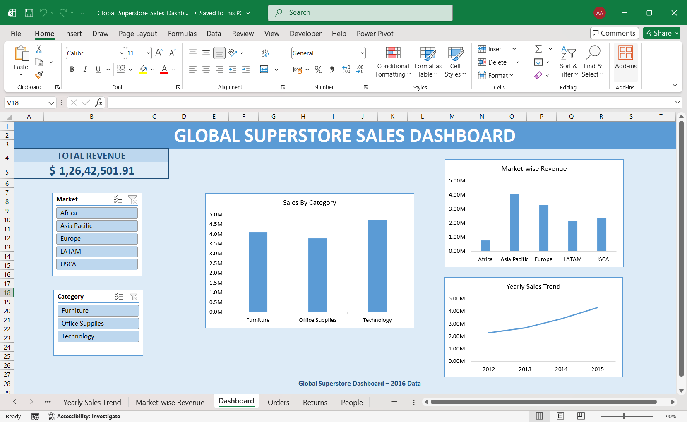

# 📊 Global Superstore Sales Dashboard

## Project Overview

This project analyzes the Global Superstore 2016 dataset using Microsoft Excel.

The dashboard was created using Pivot Tables, Pivot Charts, KPI Cards and Slicers to provide business insights.

---

## Dashboard Preview



---

## Key Metrics

- Total Revenue
- Sales by Category
- Revenue by Market
- Yearly Sales Trend

---

## Tools Used

- Microsoft Excel
- Pivot Tables
- Pivot Charts
- Slicers
- KPI Cards

---

## 📁 Project Structure

```text
Task1/
│
├── Dataset/
│   └── global_superstore_2016.xlsx
│
├── Global_Superstore_Sales_Dashboard.xlsx
│
├── images/
│   ├── category_chart.png
│   ├── dashboard.png
│   ├── market_revenue.png
│   └── yearly_trend.png
│
└── README.md
```

---

## Dashboard Features

- Interactive Dashboard
- Dynamic Filtering using Slicers
- Business KPI Cards
- Sales Trend Analysis

---

## Author

Aayush Aggarwal
