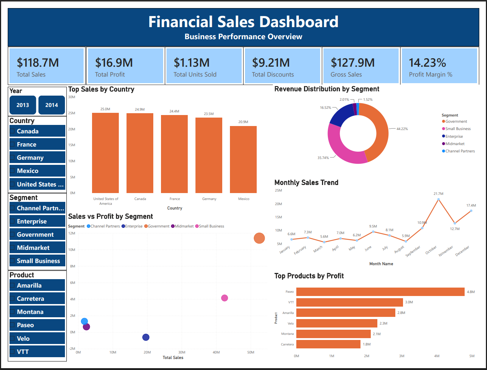

# 📊 Task 4 - Power BI Financial Sales Dashboard

## 📌 Overview

This project was completed as part of **Week 4** of the **Skill Nexis Data Analyst Internship**.

The objective was to build an interactive business dashboard using **Microsoft Power BI** to analyze financial sales data and generate meaningful business insights.

---

# 🎯 Objectives

- Import and transform financial sales data
- Create business KPIs using DAX
- Build an interactive dashboard
- Analyze sales performance
- Compare profits across products and countries
- Enable dynamic filtering with slicers

---

# 🗂 Dataset

**Dataset:** Microsoft Financial Sample Dataset

The dataset contains financial transaction records including:

- Segment
- Country
- Product
- Sales
- Profit
- Gross Sales
- Discounts
- Units Sold
- Date

---

# 🛠 Tools Used

- Microsoft Power BI Desktop
- Power Query
- DAX (Data Analysis Expressions)

---

# 📈 Dashboard Components

### KPI Cards

- 💰 Total Sales
- 📈 Total Profit
- 📦 Total Units Sold
- 💸 Total Discounts
- 💵 Gross Sales
- 📊 Profit Margin %

---

### Visualizations

- 📊 Sales by Country (Column Chart)
- 🍩 Sales by Segment (Donut Chart)
- 📈 Monthly Sales Trend (Line Chart)
- 📉 Profit by Product (Bar Chart)
- 🔵 Sales vs Profit (Scatter Plot)

---

### Interactive Filters

- 📅 Year
- 🌍 Country
- 🏢 Segment
- 📦 Product

---

# 📊 Business Insights

- Government segment contributes the highest sales.
- United States generates the highest revenue.
- Monthly sales vary throughout the year, with noticeable peak periods.
- Profit differs across products, highlighting high-performing products.
- Interactive filters allow dynamic analysis across multiple business dimensions.

---

# 📁 Project Structure

```text
Task4/
│
├── Dataset/
│   └── Sample data.xlsx
├── Images/
│   └── dashboard_preview.png
├── PowerBI/
│   └── Financial_Sales_Dashboard.pbix
│   └── Financial_Sales_Dashboard.pdf
├── Report/
│   └── Week4_PowerBI_Report.docx
└── README.md
```

---

# 🚀 Skills Demonstrated

- Data Cleaning
- Data Modeling
- DAX Measures
- KPI Development
- Interactive Dashboard Design
- Business Intelligence
- Data Visualization
- Report Creation

---

# 📷 Dashboard Preview




---

# 👨‍💻 Author

**Aayush Aggarwal**

